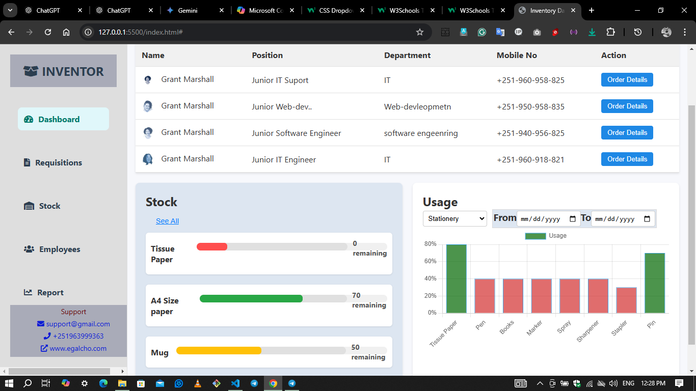

# inventory-dashboard
# Project documentation

# Inventory Dashboard

A modern, user-friendly inventory dashboard built to manage and track stock, requisitions, employees, and reports. This web application provides an interactive interface to monitor inventory status, track usage, and view employee details.

## Features

- **Sidebar Navigation**: Navigate through different sections such as Dashboard, Requisitions, Stock, Employees, and Report.
- **Requisitions Table**: View and manage requisitions with actionable buttons for details.
- **Stock Management**: Display stock levels with progress bars and alert colors to show inventory status.
- **Usage Chart**: Visual representation of inventory usage by category.
- **Responsive Design**: Designed to be used across devices with a responsive layout.

## Screenshots



## Installation

Follow these steps to run the project locally:

1. Clone the repository:
   ```bash
   git clone https://github.com/Match-all/inventory-dashboard.git
   ```

   ```bash
/inventory-dashboard
│
├── /css
│   ├── styles.css        # Main stylesheet
│
├── /images
│   ├── [Image Files]     # Various images used in the dashboard
│
├── /js
│   ├── script.js         # JavaScript for dynamic content and charts
│
├── index.html            # Main HTML file for the dashboard
└── README.md             # Project documentation

